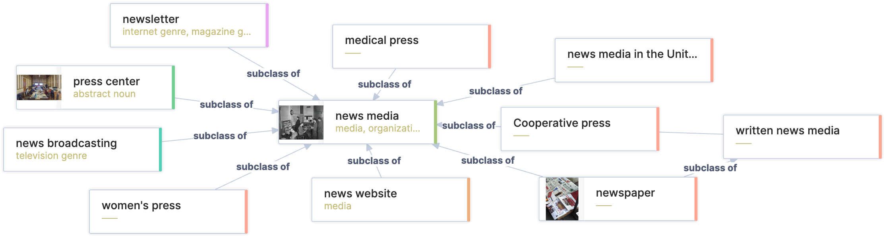
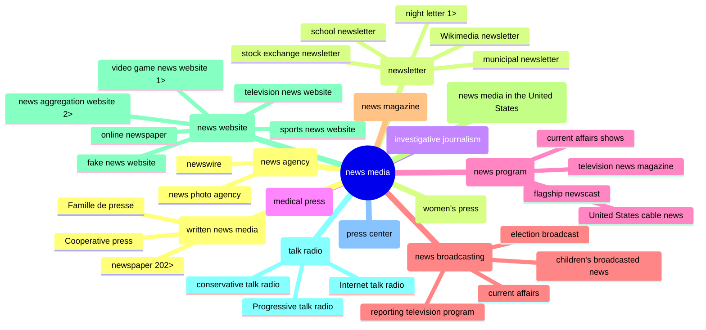

# Wiki Media Cred

*[drafting…]*  
Project Goal: Turn Wikimedia into a news-site credibility tool.

These are resources and a data diary for the <a href="https://misinfocon.com/turning-wikimedia-into-a-news-site-credibility-tool-422dbf28fdec">WikiCred/Iffy.news project</a>, adding news-site credibility indicators, found in external databases, into Wikidata/Wikipedia. The external data I have was mostly U.S. and English. Those with news-media data for other countries and languages may find this repo helpful.

The following workflow came from trial and many errors in my attempts to:
* Find news-media items in Wikidata.
* Create new items for news-media not in Wikidata.
* Match news-media items in Wikidata with their domain names (to relate Wikidata items with their entries in external databases).  
* Add data from external media databases into Wikidata (especially crediility indicaters like press-association membership and street address).

## Data dumps
Useful datasets created by this project include (more coming):
* Wikipedia: [US newspapers](https://github.com/hearvox/wiki-media-cred/blob/main/data/wikipedia-us-newspapers.tsv), auto-compiled ([code](https://github.com/hearvox/wiki-media-cred/blob/main/code/wikipedia-us-newspapers.php)) from [state listings](https://en.wikipedia.org/wiki/Category:Lists_of_newspapers_published_in_the_United_States_by_state), with WD QID and WP path and page ID.
* Wikidata: [US state press associations](https://github.com/hearvox/wiki-media-cred/blob/main/data/wd-press-assoc.tsv), added/updated via [QuickStatements](https://github.com/hearvox/wiki-media-cred/blob/main/code/wd-press-assoc-qs.sql).
* Wikidata: [US cities and towns](https://github.com/hearvox/wiki-media-cred/blob/main/data/wikidata-us-cities.tsv), with QIDs (also in [csv](https://github.com/hearvox/wiki-media-cred/blob/main/data/wikidata-us-cities.csv)).
* Wikidata: [US states](https://github.com/hearvox/wiki-media-cred/blob/main/data/wikidata-us-states.tsv), with QID, lat/lon, FIPS and abbreviations (two-letter and AP).
* Wikidata: [Identfiers](/Topics/Identifers.md), news-outlet references at external sites.

## Tools used
I gathered Wikidata items with the [Wikidata Query Service](https://query.wikidata.org/) searches (example: [`news media` in the `United States`](https://w.wiki/6k32)), added data with [Quick Statements](https://quickstatements.toolforge.org/#/) (example: [add `place of publication`](https://quickstatements.toolforge.org/#/batch/128928)) and [wikibase-cli](https://github.com/maxlath/wikibase-cli), and merged Wikidata with external datasets mostly in [Google Sheets](https://docs.google.com/spreadsheets/d/1iriRBIkiE2dyhoT1ZWCVGcHhAWvdXZTA_1hBIF-_B5A/edit#gid=266534370), helped by the [Wikipedia and Wikidata Tools](https://workspace.google.com/marketplace/app/wikipedia_and_wikidata_tools/595109124715) sheets add-on.

After starting over several times, I remembered my betters taught me to make each step replicable and reversable — so I could back out of any import mess I made. To do this, I usually added a column with a sortable flag, indicating the source of imported data — to track where things like circulation estimates and domain names came from. As they (should) say in the tech world: Move slow and fix things.

## How Wikidata thinks
Wikidata stores stuctured data used in Wikipedia and other [Wikimedia](https://www.wikimedia.org/) projects. It's a collection of entries for [Items](https://www.wikidata.org/wiki/Help:Items), "all the *things* in human knowledge, including topics, concepts, and objects." Each Item has its own page, URL, and unique QID (Q + a number).

### Property values
[`The Denver Post (Q2668654)`](https://www.wikidata.org/wiki/Q2668654) is an item. It has a label (its name), QID , a short description ("daily newspaper in Denver, Colorado"), and aliases (alternative names: "Denver Post | denverpost.com"). Those [are followed](https://www.wikidata.org/wiki/Q2668654#claims) by a list of [Statements](https://www.wikidata.org/wiki/Help:Statements) about the item. Statements have a [Property](https://www.wikidata.org/wiki/Help:Properties) (P + a number) and a [Value](https://www.wikidata.org/wiki/Help:Statements#Values) (in that property's specified data type):

| property | value | (data type) |
| ------------- | ------------- |  ------------- |
| [`instance of (P31)`](https://www.wikidata.org/wiki/Property:P31)  | [`daily newspaper (Q1110794)`](https://www.wikidata.org/wiki/Q1110794) | (Item) |
| [`inception (P571)`](https://www.wikidata.org/wiki/Property:P571)  | 1892 |  (Point in time) |
| [`official website (P856)`](https://www.wikidata.org/wiki/Property:P856) | https://www.denverpost.com/ | (URL) |

News media often have a separate [list of statements](https://www.wikidata.org/wiki/Q2668654#identifiers) under the heading [Identifiers](https://www.wikidata.org/wiki/Q2668654#identifiers). Those properties have a data type called *External identifier*, for example, [`Facebook ID (P2013)`](https://www.wikidata.org/wiki/Property:P2013) and [`ISSN (P236)`](https://www.wikidata.org/wiki/Property:P236), the International Standard Serial Number.

### Class conciousness
An item isn't always one thing. It can be a concept: a [Class](https://www.wikidata.org/wiki/User:TomT0m/Classification) of things in a heirarchy, with one item being a [`subclass of (P279)`](https://www.wikidata.org/wiki/Property:P279) of another. Each of these newsy items is a subclass of the one to its left:

[`media`](https://www.wikidata.org/wiki/Q340169) :arrow_right: [`mass media`](https://www.wikidata.org/wiki/Q11033) :arrow_right: [`news media`](https://www.wikidata.org/wiki/Q1193236) :arrow_right: [`written news media`](https://www.wikidata.org/wiki/Q17172633) :arrow_right: [`newspaper`](https://www.wikidata.org/wiki/Q11032) :arrow_right: [`daily newspaper`](https://www.wikidata.org/wiki/Q1110794)

## Coordinate categories
For this project, it was convenient to have all news-media outlets in Wikidata be an instance of, or instance of a subclass of, [`news media`](https://www.wikidata.org/wiki/Q1193236). Most already were. But some news outlets weren't showing up because they were instances of classes that weren't in the `news media` heirarchy (e.g., [`investigative journalism (Q1127717)`](https://www.wikidata.org/wiki/Q1127717), [`news program`](https://www.wikidata.org/wiki/Q1358344), [`news magazine`](https://www.wikidata.org/wiki/Q1684600). I fixed those by added statement making them a `news media` subclass. (Check this network chart in [Wikidata Graph Builder](https://angryloki.github.io/wikidata-graph-builder/?item=Q1193236&property=P279&mode=reverse&sc_color=%231c5ec3c4&sc_width=5)).

*Subclasses of `news media`, 2 levels down*

*[@todo: Briefly explain diff btwn instance and subclass]* 

A few news-outlets were instance of items that should new-media subclasses but weren't (e.g., [`news program`](https://www.wikidata.org/wiki/Q1358344) and  [`news magazine`](https://www.wikidata.org/wiki/Q1684600). I brought them into the fold (i.e., made them a `news media` subclass, or subclass of a `news media` subclass.)

The classification wrangling went something like this:
1. Get all news outlets under one general category: `news media`.
2. Get subclasses into logical categories (one or two levels down).
3. Change specific new-outlets improperly assigned `subclass` to 'instance of`.
4. Label unlabled subclasses (one or two levels down), consulting the item's Wikipedia article or `official website` for the best name.

## Match domains
*[@todo: Describe ways to find, confirm website URL, and add both to new-media items.]*

## Crowd-wisdom classes
*[@todo: Briefly explain: Find out which properties WD folk use most often for news-media items. Then go with the wiki-crowd wisdom in deciding which property/class to use.]*

### Put publications in their place
*[@todo: Briefly explain: The city was most often a `place of publication`, but sometimes was `headquarters location` (P159), `location` (P276), and/or `located in the administrative territorial entity` (P131).]*

*[@todo: Place— coverage, printing.]*

*[@todo: Add `street address` (P6375) (use format in prop's example: street, city, state, zip)]*

*[@done: Add `place of publication` to all news media.]*

### Preparing for the End Times
*[@todo: Briefly explain: The date a publicaton ceased was 90% in dissolved, abolished or demolished (`P576`) statements, with the rest as end time (`P582`).*

*[@done: Done: Copy all dates in `end time` into `dissolved…` (with precision: day, month, or year).]*

*[@todo: Briefly explain: date precision.]*

### Members only
*[@todo: Briefly explain: Membership in a press asscoiation was almost always `member of` ([P463](https://www.wikidata.org/wiki/Property:P463)) but a few times `affiliation` ([P1416](https://www.wikidata.org/wiki/Property:P1416)).]*

<!--
The [Wikidata Query Service](https://query.wikidata.org/) searches Wikidata using the [SPARQL](https://www.wikidata.org/wiki/Wikidata:SPARQL_query_service/Wikidata_Query_Help) language. Queries must be effecient because its searches timesout in 60 seconds.

LABEL ([`Q`]((https://www.wikidata.org/wiki/Q))
*class* ([`Q`]((https://www.wikidata.org/wiki/Q))  
*property* ([`P`](https://www.wikidata.org/wiki/Property:P))

member of:
Institute for Nonprofit News (Q6060703)
Local Independent Online News (LION) Publishers (Q104172660)
example:
The Beacon
https://www.wikidata.org/wiki/Q104880644

https://statesnewsroom.com/newsrooms/

Inter American Press Association ([`Q1626261`](https://www.wikidata.org/wiki/Property:P463)) ([SPARQL](https://query.wikidata.org/#SELECT%20DISTINCT%20%3Fitem%20%3FitemLabel%20%3Fmember%20%3FmemberLabel%20%3Faffil%20%3FaffilLabel%0AWHERE%20%7B%0A%20%20%7B%3Fitem%20wdt%3AP1416%7Cwdt%3AP463%20wd%3AQ1626261%20.%7D%0A%20%20OPTIONAL%20%7B%3Fitem%20wdt%3AP463%20%3Fmember%20.%7D%0A%20%20OPTIONAL%20%7B%3Fitem%20wdt%3AP1416%20%3Faffil%20.%7D%0A%20%20SERVICE%20wikibase%3Alabel%20%7B%20bd%3AserviceParam%20wikibase%3Alanguage%20%22%5BAUTO_LANGUAGE%5D%2Cen%22.%20%7D%0A%7D%0AORDER%20BY%20ASC%28%3FitemLabel%29%20LIMIT%2040000))

*place of publication* ([`P291`](https://www.wikidata.org/wiki/Property:P291))

In SPARQL: [`{?item wdt:P31/wdt:P279* wd:Q1193236 .}`](https://query.wikidata.org/#SELECT%20DISTINCT%20%3Fitem%20%3FitemLabel%20%3FitemDescription%20%3FitemAltLabel%0AWHERE%20%7B%0A%20%20%7B%3Fitem%20wdt%3AP31%2Fwdt%3AP279%2a%20wd%3AQ1193236%20.%7D%0A%20%20SERVICE%20wikibase%3Alabel%20%7B%20bd%3AserviceParam%20wikibase%3Alanguage%20%22%5BAUTO_LANGUAGE%5D%2Cen%22.%20%7D%0A%20%20%3Fitem%20rdfs%3Alabel%20%3FitemLabel%20.%0A%7D%0AORDER%20BY%20ASC%28%3FitemLabel%29%20LIMIT%20250000))
-->
