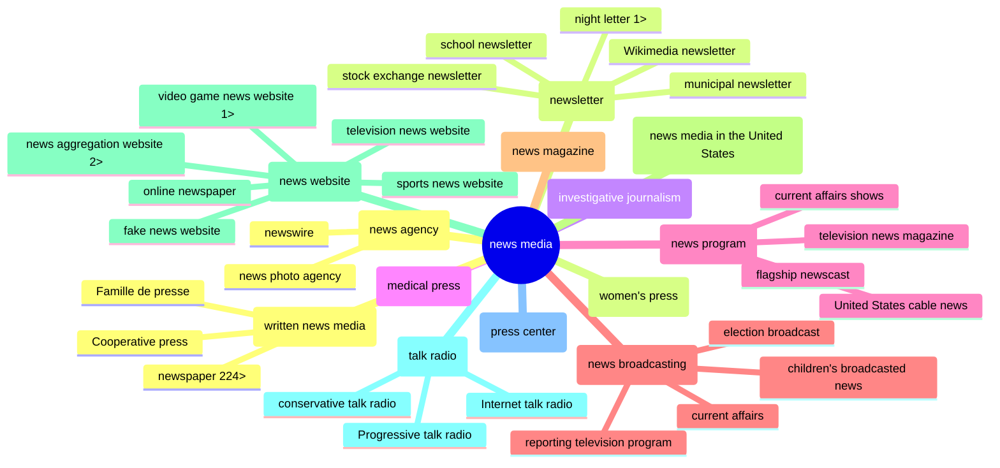

# CredCo 2024-02-07: Wiki Media Cred

*[Draft of notes for CredCo meeting 2024-02-07…]*

MisinfoCon: [Turning Wikimedia into a news-site credibility tool](https://misinfocon.com/turning-wikimedia-into-a-news-site-credibility-tool-422dbf28fde) 
Repo: [Wiki Media Cred](https://github.com/hearvox/wiki-media-cred/)

Wikipedia article: [Star Tribune](https://en.wikipedia.org/wiki/Star_Tribune)
Wikidata item: [Star Tribune (Q862148)]https://www.wikidata.org/wiki/Q862148}

English Wikpedia doesn't draw from Wikidata not does it have an easy to ad data (it Infobox).

Wikidata instance or subclass of: news media

Pete Forsyth

https://www.wikidata.org/wiki/Wikidata:Tools/OpenRefine

https://en.wikipedia.org/wiki/Wikipedia_talk:WikiProject_Newspapers

https://en.wikipedia.org/wiki/Wikipedia:WikiProject_Journalism

https://www.wikidata.org/wiki/Wikidata:WikiProject_Source_Reliability

https://www.wikidata.org/wiki/Wikidata:WikiProject_Periodicals

https://www.wikidata.org/wiki/Wikidata:Tools

Reasonator
https://reasonator.toolforge.org/?q=Q1193236

newsmedia subclasses: https://w.wiki/94zh

## Tools
Wikidata Query Service: [news media in the US](https://w.wiki/94zY)

[Wikidata Graph Builder](https://angryloki.github.io/wikidata-graph-builder/?item=Q1193236&amp;property=P279&amp;mode=reverse&amp;sc_color=%231c5ec3c4&amp;sc_width=5]

metaphactory: [news media](https://wikidata.metaphacts.com/resource/wd:Q1193236)

[Quick Statements](https://quickstatements.toolforge.org/#/) (example: [add `place of publication`](https://quickstatements.toolforge.org/#/batch/128928)) and [wikibase-cli](https://github.com/maxlath/wikibase-cli)

*Subclasses of `news media`, 2 levels down*
