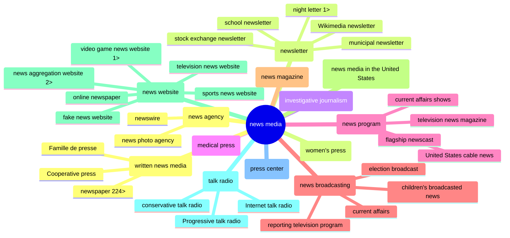

<h1>Wiki Media Cred: CredCo 2024-02-07</h1>

<em>[Draft of notes for CredCo meeting 2024-02-07…]</em>

<ul>
<li>MisinfoCon: <a href="https://misinfocon.com/turning-wikimedia-into-a-news-site-credibility-tool-422dbf28fde">Turning Wikimedia into a news-site credibility tool</a>
<li>GitHub repo:<a href="https://github.com/hearvox/wiki-media-cred/">Wiki Media Cred</a></li>	
</li>	
</ul>

<h2></h2>Wikimedia news-related projects</h2>
<ul dir="auto">
<li><a href="https://en.wikipedia.org/wiki/Wikipedia:WikiProject_Newspapers">Wikipedia:WikiProject Newspapers</a></li>
<li><a href="https://www.wikidata.org/wiki/Wikidata:WikiProject_Periodicals">Wikidata:WikiProject Periodicals</a></li>
<li><a href="https://www.wikidata.org/wiki/Wikidata:WikiProject_Source_Reliability">Wikidata:WikiProject Source Reliability</a> =  <strong>WD: CRAP</strong> (Credibility Ratings + Assessments Project)</li>
</ul>

> [!NOTE] 
> Wikimedia pages have a Talk (or Discussion) and History subpages.

<ul dir="auto">
<li>Wikipedia article: <a href="https://en.wikipedia.org/wiki/Star_Tribune">Star Tribune</a> (uses the <a href="https://en.wikipedia.org/wiki/Template:Infobox_newspaper">Infobox newspaper</a> template)</li>
<li>Wikidata item: <a href="https://www.wikidata.org/wiki/Q862148">Star Tribune (Q862148)</a></li>
<li></li>
</ul>

> [!NOTE] 
> Unlike many other languages, English Wikpedia doesn't pull from Wikidata (yet: there are efforts to build the Infobox from Wikidata).

Wikidata instance or subclass of: news media

Pete Forsyth

https://www.wikidata.org/wiki/Wikidata:Tools/OpenRefine

https://en.wikipedia.org/wiki/Wikipedia:WikiProject_Journalism

https://www.wikidata.org/wiki/Wikidata:Tools

Reasonator
https://reasonator.toolforge.org/?q=Q1193236

newsmedia subclasses: https://w.wiki/94zh

https://iffy.news/fact-check-search/?q=startribune.com

## Tools
Wikidata Query Service: [news media in the US](https://w.wiki/94zY)

OpenRefine

Iffy Fact-check Search

[Wikidata Graph Builder](https://angryloki.github.io/wikidata-graph-builder/?item=Q1193236&amp;property=P279&amp;mode=reverse&amp;sc_color=%231c5ec3c4&amp;sc_width=5]

metaphactory: [news media](https://wikidata.metaphacts.com/resource/wd:Q1193236)

[Quick Statements](https://quickstatements.toolforge.org/#/) (example: [add `place of publication`](https://quickstatements.toolforge.org/#/batch/128928)) and [wikibase-cli](https://github.com/maxlath/wikibase-cli)

<!--

SUMMARY

<code>DETAILS</code>

<ul dir="auto">
<li><a href="">TEXT</a></li>
<li><a href="">TEXT</a></li>
</ul>
-->

*Subclasses of `news media`, 2 levels down*
