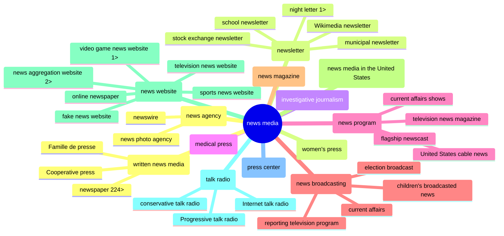

<em>[Draft of notes for CredCo meeting 2024-02-07…]</em>
<h1>Wiki Media Cred: CredCo 2024-02-07</h1>
<ul dir="auto">
<li>MisinfoCon: <a href="https://misinfocon.com/turning-wikimedia-into-a-news-site-credibility-tool-422dbf28fdec">Turning Wikimedia into a news-site credibility tool</a></li>
<li>GitHub repo: <a href="https://github.com/hearvox/wiki-media-cred/">Wiki Media Cred</a></li>		
</ul>

   

<h2>Wikimedia news-related projects</h2>
<ul dir="auto">
<li><a href="https://en.wikipedia.org/wiki/Wikipedia:WikiProject_Newspapers">Wikipedia:WikiProject Newspapers</a></li>
<li><a href="https://www.wikidata.org/wiki/Wikidata:WikiProject_Periodicals">Wikidata:WikiProject Periodicals</a></li>
<li><a href="https://www.wikidata.org/wiki/Wikidata:WikiProject_Source_Reliability">Wikidata:WikiProject Source Reliability</a> =  <strong>WD: CRAP</strong> (Credibility Ratings + Assessments Project)</li>
</ul>

> [!NOTE] 
Wikimedia pages have <a href="https://www.wikidata.org/wiki/Wikidata_talk:WikiProject_Source_Reliability">Talk</a> and <a href="https://www.wikidata.org/w/index.php?title=Wikidata:WikiProject_Periodicals&action=history">History</a> subpages.

   
<h2>The Way of Wikimedia</h2>

<ul dir="auto">
<li>Wikipedia article: <a href="https://en.wikipedia.org/wiki/Star_Tribune">Star Tribune</a> (uses the <a href="https://en.wikipedia.org/wiki/Template:Infobox_newspaper">Infobox newspaper</a> template)</li>
<li>Wikidata item: <a href="https://www.wikidata.org/wiki/Q862148">Star Tribune (Q862148)</a></li>
</ul>

> [!NOTE]
English Wikpedia doesn't pull Wikidata (yet). Many languages do.

 
<ul dir="auto">
<li>Statement: The <em>item</em> has a <em>property</em> with a <em>value</em>.</li>
<li><a href="https://github.com/hearvox/wiki-media-cred/blob/main/Topics/Identifers.md">Identfier</a>: A statement with a value that is a unique ID, often an URL path.</li>
</ul>

| property | value | (data type) |
| ------------- | ------------- |  ------------- |
| [`instance of (P31)`](https://www.wikidata.org/wiki/Property:P31)  | [`daily newspaper (Q1110794)`](https://www.wikidata.org/wiki/Q1110794) | (Item) |
| [`inception (P571)`](https://www.wikidata.org/wiki/Property:P571)  | 25 May 1867 |  (Point in time) |
| [`official website (P856)`](https://www.wikidata.org/wiki/Property:P856) | https://www.startribune.com/ | (URL) |

 
<ul dir="auto">
<li>Items have unique QIDs (Q + a number).</li>
<li>Properties have PIDs (P + a number).</li>
<li>An item can be a group of things, a <em>class</em>, which can have <em>subclasses</em>.</li>
</ul>

[`media`](https://www.wikidata.org/wiki/Q340169) :arrow_right: [`mass media`](https://www.wikidata.org/wiki/Q11033) :arrow_right: [`news media`](https://www.wikidata.org/wiki/Q1193236) :arrow_right: [`written news media`](https://www.wikidata.org/wiki/Q17172633) :arrow_right: [`newspaper`](https://www.wikidata.org/wiki/Q11032) :arrow_right: [`daily newspaper`](https://www.wikidata.org/wiki/Q1110794)

   
<h2>Tools: Query</h2>

Tools used for this Wiki Media Cred project, found in the <a href="https://www.wikidata.org/wiki/Wikidata:Tools">Wikidata Tools</a> lists. 

<ul dir="auto">
<li>Browser extension: <a href="https://www.wikidata.org/wiki/Wikidata:Tools/Wikidata_for_Web">Wikidata for Web</a> (e.g., <a href="https://www.cnn.com/">CNN</a>)</li>
<li>Google Sheet add-on: <a href="https://workspace.google.com/marketplace/app/wikipedia_and_wikidata_tools/595109124715">Wikipedia and Wikidata Tools</a> (e.g., get <a href="https://docs.google.com/spreadsheets/d/1__i9EibnQ6vgjUKESJrIkcNTbVinahrCukhUOAIOiUw/edit#gid=842167339">label, description, place</a>)</li>	
<li>SPARQL: <a href="https://www.wikidata.org/wiki/Wikidata:SPARQL_query_service/Wikidata_Query_Help">Wikidata Query Help</a> </li>
<li><a href="https://query.wikidata.org/">Wikidata Query Service</a>:
<ul dir="auto">
<li>Query: <a href="https://w.wiki/94zY"><code>news media (Q1193236)</code> in the <code>USA (Q30)</code></a></li>
<li>Query: <a href="https://w.wiki/94zh"><code>news media</code> and <code>newspaper (Q11032)</code> subclasses</a></li>
</ul></li>
</ul>

   
<h2>Tools: Dataviz</h2>

<ul dir="auto">
<li><a href="https://wikidata.metaphacts.com/resource/wd:Q1193236">Metaphactory</a> org chart</li>
<li><a href="https://reasonator.toolforge.org/?q=Q1193236">Reasonator</a> item-type-optimized view</li>
<li><a href="https://angryloki.github.io/wikidata-graph-builder/?item=Q1193236&amp;property=P279&amp;mode=reverse&amp;sc_color=%231c5ec3c4&amp;sc_width=5">Wikidata Graph Builder</a> network viz</li>
</ul>

   
<h2>Tools: Edit</h2>
<ul dir="auto">
<li><a href="https://github.com/maxlath/wikibase-cli">Wikibase-CLI</a> terminal app</li>
<li><a href="https://openrefine.org/">OpenRefine</a> desktop app (<a href="https://www.wikidata.org/wiki/Wikidata:Tools/OpenRefine#Wikidata_reconciliation">Wikidat reconciliation</a>)</li>
<li><a href="https://quickstatements.toolforge.org/#/">Quick Statements</a>: browser tool (e.g., <a href="https://quickstatements.toolforge.org/#/batch/221965">add press association membership, with reference</a>)</li>
</ul>

   
<h2>Wikidata in the Wild</h2>
<ul dir="auto">
<li><a href="https://github.com/hearvox/wiki-media-cred/blob/main/README.md#data-dumps">WMC data dumps:</a>
<ul dir="auto">
<li>Wikipedia: <a href="https://github.com/hearvox/wiki-media-cred/blob/main/data/wikipedia-us-newspapers.tsv">US newspapers</a></li>
<li>Wikidata: <a href="https://github.com/hearvox/wiki-media-cred/blob/main/data/wd-press-assoc.tsv">US state press associations</a></li>
<li>Wikidata: <a href="https://github.com/hearvox/wiki-media-cred/blob/main/data/wikidata-us-cities.tsv">US cities</a>, with QIDs</li>
<li>Wikidata: <a href="https://github.com/hearvox/wiki-media-cred/blob/main/data/wikidata-us-states.tsv">US states</a>, with QID, lat/lon, FIPS,</li>
<li>Wikidata: <a href="https://github.com/hearvox/wiki-media-cred/blob/main/Topics/Identifers.md">Identfiers</a>, news-outlet references at external sites.</li>
</ul></li>
<li><a href="https://iffy.news/fact-check-search/?q=startribune.com">Iffy.news: Fact-check Search</a></li>
<li>Spiffy News: Index of Reliable Sources Fact-check Search</li>
</ul>

*Subclasses of `news media`, 2 levels down*

<!--

SUMMARY

<code>DETAILS</code>

<ul dir="auto">
<li><a href="">TEXT</a></li>
<li><a href="">TEXT</a></li>
</ul>

OpenRefine: http://127.0.0.1:3333/project?project=2059350619109

GitHub syntax:
https://docs.github.com/en/get-started/writing-on-github/getting-started-with-writing-and-formatting-on-github/basic-writing-and-formatting-syntax
https://github.com/DavidWells/advanced-markdown

-->
