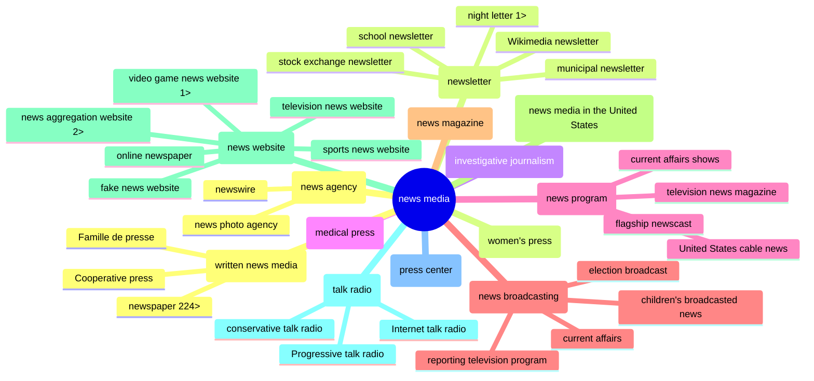

<h1>Wiki Media Cred: CredCo 2024-02-07</h1>

<em>[Draft of notes for CredCo meeting 2024-02-07…]</em>

<h2>Wikimedia news-related projects</h2>
<ul dir="auto">
<li><a href="https://en.wikipedia.org/wiki/Wikipedia:WikiProject_Newspapers">Wikipedia:WikiProject Newspapers</a></li>
<li><a href="https://www.wikidata.org/wiki/Wikidata:WikiProject_Periodicals">Wikidata:WikiProject Periodicals</a></li>
<li><a href="https://www.wikidata.org/wiki/Wikidata:WikiProject_Source_Reliability">Wikidata:WikiProject Source Reliability</a> =  <strong>WD: CRAP</strong> (Credibility Ratings + Assessments Project)</li>
</ul>

> [!NOTE] 
Wikimedia pages have <a href="https://www.wikidata.org/wiki/Wikidata_talk:WikiProject_Source_Reliability">Discussion</a> (or <a href="https://en.wikipedia.org/w/index.php?title=Wikipedia:WikiProject_Newspapers&action=history)">Talk</a>) and <a href="https://www.wikidata.org/w/index.php?title=Wikidata:WikiProject_Periodicals&action=history">History</a> subpages.

<h2>The Way of Wikimedia</h2>

<ul dir="auto">
<li>Wikipedia article: <a href="https://en.wikipedia.org/wiki/Star_Tribune">Star Tribune</a> (uses the <a href="https://en.wikipedia.org/wiki/Template:Infobox_newspaper">Infobox newspaper</a> template)</li>
<li>Wikidata item: <a href="https://www.wikidata.org/wiki/Q862148">Star Tribune (Q862148)</a></li>
</ul>

> [!NOTE]
Unlike many other languages, English Wikpedia doesn't pull from Wikidata (yet).

<ul dir="auto">
<li>Item: has a Q ID (Q + a number), for person, place or thing.</li>
<li>Property: has a P ID (P + a number), for person, place or thing.</li>
<li>Statement: Item has a property with this value.</li>
<li>Value: Can be an item of a string.</li>
<li>Identfier: Statement with a value that is a unique ID, often an URL path.</li>
<li><a href="">TEXT</a></li>
</ul>

| property | value | (data type) |
| ------------- | ------------- |  ------------- |
| [`instance of (P31)`](https://www.wikidata.org/wiki/Property:P31)  | [`daily newspaper (Q1110794)`](https://www.wikidata.org/wiki/Q1110794) | (Item) |
| [`inception (P571)`](https://www.wikidata.org/wiki/Property:P571)  | 1892 |  (Point in time) |
| [`official website (P856)`](https://www.wikidata.org/wiki/Property:P856) | https://www.denverpost.com/ | (URL) |

Wikidata instance or subclass of: news media

<h2>Tools: Query/Edit</h2>
Tools used for this Wiki Media Cred project, 

https://www.wikidata.org/wiki/Wikidata:Tools

Wikidata Query Service: [news media in the US](https://w.wiki/94zY)

newsmedia subclasses: https://w.wiki/94zh

[Quick Statements](https://quickstatements.toolforge.org/#/) (example: [add `place of publication`](https://quickstatements.toolforge.org/#/batch/128928)) and [wikibase-cli](https://github.com/maxlath/wikibase-cli)

OpenRefine: https://openrefine.org/

https://www.wikidata.org/wiki/Wikidata:Tools/OpenRefine

<h2>Tools: Dataviz</h2>

[Wikidata Graph Builder](https://angryloki.github.io/wikidata-graph-builder/?item=Q1193236&amp;property=P279&amp;mode=reverse&amp;sc_color=%231c5ec3c4&amp;sc_width=5]

metaphactory: [news media](https://wikidata.metaphacts.com/resource/wd:Q1193236)

Reasonator
https://reasonator.toolforge.org/?q=Q1193236

<h2>Wikidat pull</h2>

Iffy Fact-check Search

https://iffy.news/fact-check-search/?q=startribune.com

<!--

SUMMARY

<code>DETAILS</code>

<ul dir="auto">
<li><a href="">TEXT</a></li>
<li><a href="">TEXT</a></li>
</ul>

OpenRefine: http://127.0.0.1:3333/project?project=2059350619109

GitHub syntax:
https://docs.github.com/en/get-started/writing-on-github/getting-started-with-writing-and-formatting-on-github/basic-writing-and-formatting-syntax
https://github.com/DavidWells/advanced-markdown?

-->

*Subclasses of `news media`, 2 levels down*

<h2>Wiki Media Cred</h2>
<ul dir="auto">
<li>MisinfoCon: <a href="https://misinfocon.com/turning-wikimedia-into-a-news-site-credibility-tool-422dbf28fde">Turning Wikimedia into a news-site credibility tool</a></li>
<li>GitHub repo:<a href="https://github.com/hearvox/wiki-media-cred/">Wiki Media Cred</a></li>		
</ul>
